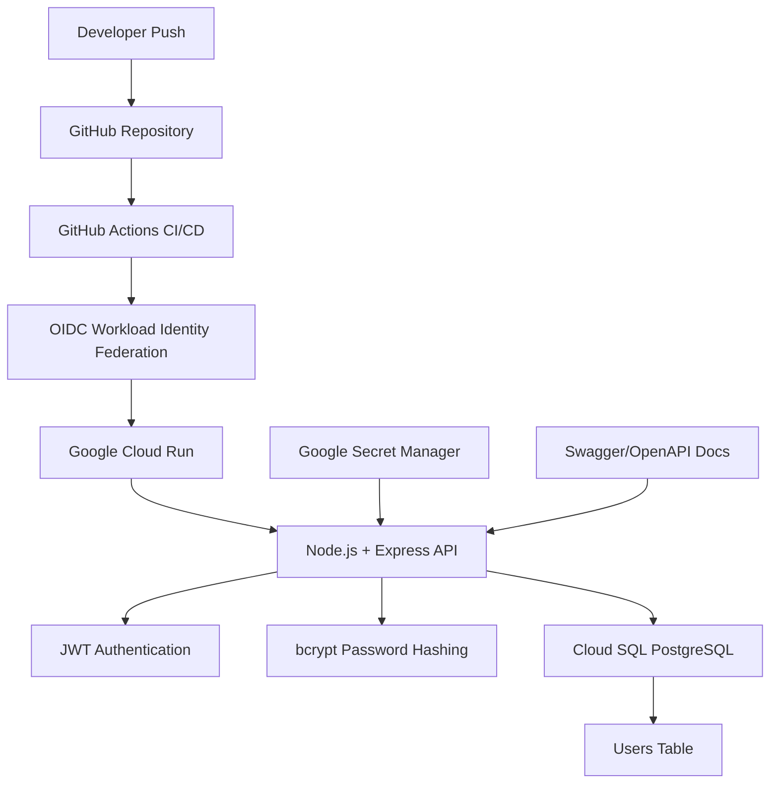
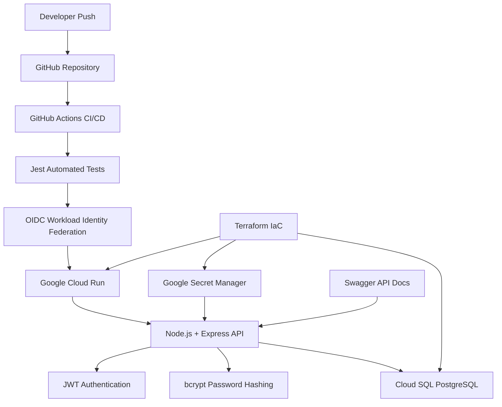

# 🔐 Secure API – Production-Style DevSecOps Backend

A production-style secure backend API built with **Node.js, PostgreSQL, Google Cloud Run, Cloud SQL, JWT authentication, CI/CD, and Secret Manager**, following modern **cloud-native DevSecOps practices**.

This project demonstrates real-world backend deployment, secure authentication, cloud infrastructure integration, automated deployment pipelines, and secrets management using Google Cloud Platform.

---

## 🚀 Live Demo

### API Endpoint
https://secure-api-1097545195926.us-central1.run.app

### Swagger Documentation
https://secure-api-1097545195926.us-central1.run.app/docs

### GitHub Repository
https://github.com/marlondev84/devsecops-project

---

## 📌 Project Overview

This project was designed to simulate a **real production backend service**, implementing:

- Secure JWT authentication
- Password hashing using bcrypt
- PostgreSQL database integration
- Cloud-native deployment to Google Cloud Run
- Cloud SQL managed PostgreSQL database
- Secure credential storage with Secret Manager
- Automated CI/CD pipeline using GitHub Actions
- OIDC Workload Identity Federation (no static credentials)
- Interactive Swagger/OpenAPI documentation

The goal was to create a project aligned with **real DevOps, Cloud, and Backend engineering practices** used in modern production environments.

## 🏗️ Architecture Diagram



### Architecture Overview

This project follows a **production-style cloud-native architecture**:

- **GitHub Actions** automatically deploys code after every push to `main`
- **OIDC Workload Identity Federation** securely authenticates CI/CD with GCP (no service account keys)
- **Cloud Run** hosts the containerized Node.js backend
- **Cloud SQL PostgreSQL** stores application users securely
- **bcrypt** hashes passwords before database storage
- **JWT authentication** protects private API routes
- **Google Secret Manager** securely injects credentials into production
- **Swagger/OpenAPI** provides live API documentation for testing and validation


## 🏗️ Architecture



⚙️ Tech Stack
Backend
Node.js
Express.js
Security
JWT Authentication
bcrypt Password Hashing
Helmet.js
Google Secret Manager
Database
PostgreSQL
Google Cloud SQL
Cloud & DevOps
Google Cloud Run
GitHub Actions CI/CD
Workload Identity Federation (OIDC)
IAM Permissions
Docker
Documentation
Swagger / OpenAPI
🔐 Security Features
JWT Authentication

Protected routes require a valid JWT token.

Password Hashing

Passwords are securely hashed using bcrypt before storage.

Secrets Management

Sensitive credentials such as:

Database password
JWT secret

are securely stored in Google Secret Manager, avoiding hardcoded credentials or exposed secrets in source code.

Secure Cloud Authentication

CI/CD authentication is implemented using OIDC Workload Identity Federation, eliminating the need for long-lived service account keys.

🧪 API Endpoints
Health Check
GET /health

Response:
{
  "status": "ok"
}
Login
POST /login

Request body:
{
  "username": "admin",
  "password": "123456"
}

Response:
{
  "token": "JWT_TOKEN"
}
Protected Route
GET /protected

Authorization:

Bearer YOUR_JWT_TOKEN

Response:

{
  "message": "Protected route accessed"
}
🔄 CI/CD Pipeline

Every push to the main branch automatically triggers:

GitHub Actions workflow
Secure authentication to GCP using OIDC
Cloud Run deployment
Application update in production

This simulates a real production deployment workflow.

☁️ Cloud Infrastructure
Google Cloud Run

Serverless deployment for scalable containerized applications.

Cloud SQL (PostgreSQL)

Managed relational database used for real authentication persistence.

Secret Manager

Secure storage for production secrets and credentials.

IAM & OIDC Federation

Fine-grained access control and secure CI/CD authentication without exposed keys.

## 🏗️ Infrastructure as Code (Terraform)

Infrastructure provisioning and management are handled using **Terraform**, enabling reproducible and production-style cloud environments.

Managed resources include:

- Google Cloud Run
- Cloud SQL PostgreSQL
- Secret Manager integration
- Cloud SQL connections
- Environment variables
- Infrastructure state management

### Why Terraform?

Terraform enables:

- Infrastructure versioning
- Reproducible deployments
- Safer infrastructure changes
- Cloud resource automation
- Infrastructure consistency across environments

Example workflow:

```bash
terraform init
terraform plan
terraform apply
```

This project imports and manages existing production infrastructure using **Terraform state reconciliation**, following real-world DevOps practices.

💡 ## 💡 Key Skills Demonstrated

### Backend & API Development
- Backend Development
- REST API Design
- Express.js
- Node.js

### Security
- API Security
- JWT Authentication
- Password Hashing (bcrypt)
- Helmet.js Security Headers
- Secret Management
- Google Secret Manager
- IAM Permissions

### Database & Persistence
- PostgreSQL Database Design
- Cloud SQL Integration
- Secure User Authentication Persistence

### Cloud & Infrastructure
- Google Cloud Run Deployment
- Dockerized Applications
- Infrastructure as Code (Terraform)
- Cloud Infrastructure Management
- OIDC Workload Identity Federation

### DevOps & CI/CD
- CI/CD Automation
- GitHub Actions
- Automated Testing (Jest + Supertest)
- Deployment Gating
- Production-style Cloud Deployments

### Documentation & Observability
- Swagger / OpenAPI Documentation
- API Testing & Validation

## 📊 Monitoring & Observability

Production-style monitoring was implemented using Google Cloud Monitoring.

Features include:

- API uptime monitoring
- Automated health checks
- Availability validation
- Failure detection
- Email alerting

### Uptime Monitoring

Google Cloud continuously checks:

```text
/health
```

endpoint availability and triggers alerts if the service becomes unavailable.

This simulates real-world production observability and reliability engineering practices.

### Engineering Practices
- DevSecOps Best Practices
- Infrastructure State Management
- Secure Secret Injection
- Production-oriented Backend Architecture

---

## 📈 Future Improvements

- Monitoring & Logging (Cloud Monitoring / Logging)
- Rate Limiting Improvements
- Role-Based Access Control (RBAC)
- Multi-environment Deployments (dev / staging / prod)
- Terraform Expansion for Full Infrastructure Coverage
- Container Registry Optimization
- Kubernetes / GKE Deployment
- Infrastructure Monitoring & Alerts
- Test Coverage Expansion

👨‍💻 Author

Marlon Hoeser

DevOps / Cloud / Backend Engineering Portfolio Project

GitHub: https://github.com/marlondev84

LinkedIn: www.linkedin.com/in/marlon-hoeser-772986176


